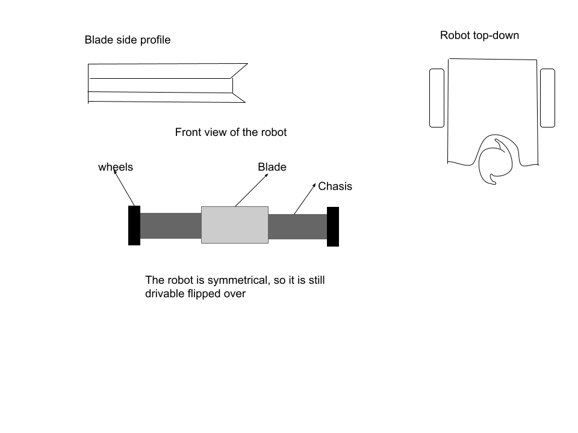
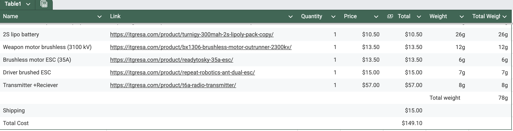

# The quasar

## Day 1
**Time spent: 3 hours**
Today I spent time researching parts, and deciding what sort of robot I wanted to build. Looking at some local competitions, I decided that fairyweight was probably best for a 3d printed bot, so the constraint for this is that it has to be less
than 150g. 

I started out with coming up with a general idea for a bot, and I decided on aa lateral spinning bot that has top-down symmetry. I am planning on using a symmetrical blade with a slanted edge. I also
made a rough sketch of the general idea of the bot, but I am now thinking of adding wheel armor.

Next I had too decide on parts. After a lot of research (reddit was very useful here) I decided on some motors for the robot. It seemed that turnabot was good for the N20s, and I decided on a lower RPM of 800, as driving slow is hard enough, however, this is pretty easy to change for a faster bot. Also for the weapon motor I decided to use a brrussless BX1306, with a KV of 3100, so it should spin pretty fast with a 2 cell lipo battery. The ESCs were pretty standard, but the main cost was the transmitter and the reciever, which ended up being much more expensive than I expected. After compiling all of the parts, I came up with a BOM and the approximate weight of each part, so I have a good budget of weight for the chasis and blade.

**tldr: selected components; made a BOM, and calculated weight**
