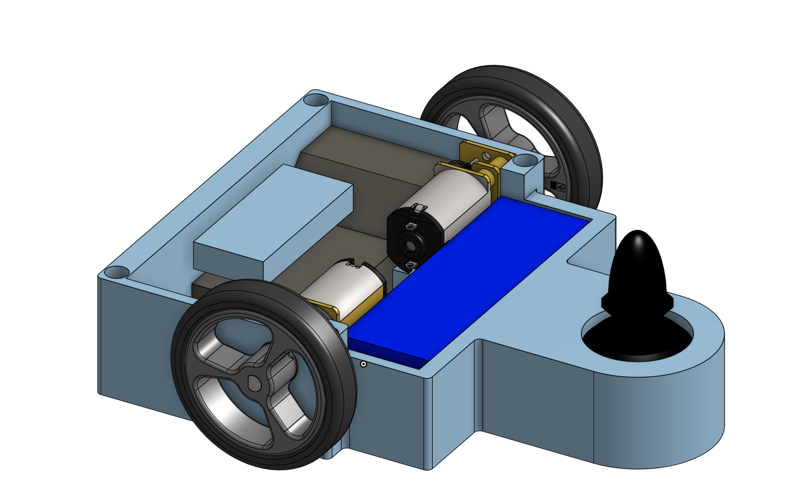
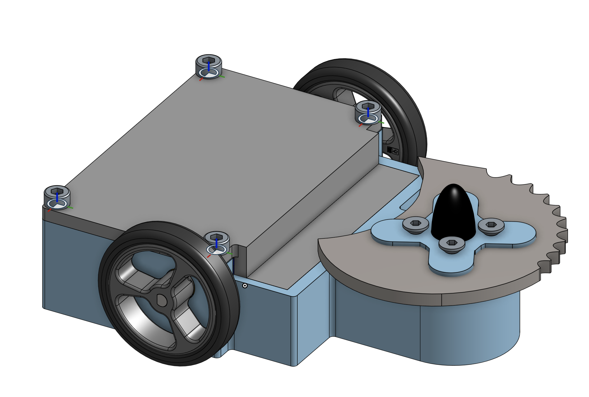

# The Quasar
**A fairyweight combat robot**

## Weapon
This uses a 22 gram titanium assymetric blade, so it should have a a large bite instead of a sawing effect.
## CAD
You can access the CAD in [this](https://cad.onshape.com/documents/3d55290af9ce6babeaef3911/w/1bdcf87fcaebbf56540309ae/e/9293975650e765cd10d42e9f?renderMode=0&uiState=6a4efc69f4e375455e2fadfa) link. This has how all of the partss fit together, and also the parts that you will need to print. 

## Electronics
Both of the ESCs arre connected to the lipo. 
The dual ESC is connected to the 2 N20s.
Two rerciever channels go to the drive ESC, while one goes to the wepon ESC.
The reciever is powered by the driver ESC- BEC.
The weapon motor is connected to the weapon ESC.

## Parts
I ordered everytthing from ne site in order to save on shipping, but most of these parts could also be sourced from other places.The most expensive part is the remote, which you could reuses if you already have a drone controller, otherwise it costs aboout $170 USD.

|Name                            |Link                                                                |Quantity|Price |Total  |Weight      |Total Weight|
|--------------------------------|--------------------------------------------------------------------|--------|------|-------|------------|------------|
|N20 motors 800 (800 max rpm)    |https://itgresa.com/product/turnabot-n20-motors-1400rpm/            |2       |$12.30|$24.60 |10g         |19g         |
|2S lipo battery                 |https://itgresa.com/product/turnigy-300mah-2s-lipoly-pack-copy/     |1       |$10.50|$10.50 |26g         |26g         |
|Weapon motor brushless (3100 kV)|https://itgresa.com/product/bx1306-brushless-motor-outrunner-2300kv/|1       |$13.50|$13.50 |12g         |12g         |
|Brushless motor ESC (35A)       |https://itgresa.com/product/readytosky-35a-esc/                     |1       |$13.50|$13.50 |6g          |6g          |
|Driver brushed ESC              |https://itgresa.com/product/repeat-robotics-ant-dual-esc/           |1       |$15.00|$15.00 |7g          |7g          |
|Pololu small wheels             |https://itgresa.com/product/pololu-small-wheels/                    |1       |$4.45|$4.45   |6.2g        |6.2g        |
|Transmitter +Reciever           |https://itgresa.com/product/t6a-radio-transmitter/                  |1       |$57.00|$57.00 |8g          |8g          |
|Titanium Blade                  |https://itgresa.com/product/275-in-asymmetrical-titanium-blade/     |1       |$18.99|$18.99 |21.8g       |21.8g       |
|                                |                                                                    |        |      |       |Total weight|105g       |
|Shipping                        |                                                                    |        |      |$15.00 |            |            |
|Total Cost                      |                                                                    |        |      |$172.54|            |            |
